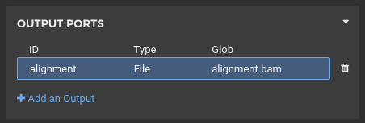

layout: true
class: content
---
# Workflows

---
## Motivation

* Most bioinformatics involves running many command-line tools; aligners like `bwa` variant callers like `gatk`, and RNA
Seq tools like `edgeR`
* However, once this list of tools reaches a certain quantity and complexity, it becomes hard to  reproduce exactly what you ran and with what parameters
* A bash script may help with this, but proper workflows...

    * Run fully parallel to speed up execution
    * Work automatically with batch systems like SLURM
    * Are written declaratively, allowing the system to work out the optimal order of execution for you
    * Save you having to hard-code input parameters and temporary files
    * Are much more readable than bash
---
# CWL Structure
---
## Tools

* Are wrappers that describe to the CWL engine how a tool works
* Include its inputs and outputs, and their format
* Any given tool can have a "correct" tool definition, unlike a workflow
* Some already exist for commonly used tools
---
## Workflows
* Explain how tools are connected to each other and in what order
* Are generally project-specific
* Can be nested inside each other
---
# Tooling for CWL
## Rabix
## Toil
* CWL has a number of "executors" - applications that can actually run CWL
* Toil is the best supported executor - it can run workflows on your laptop, on a cluster, on NeCTAR, on AWS, or an a number of other platforms
* To install Toil for CWL, run `pip install toil[cwl]`
---
# Running CWL
---
## Obtaining Tool Definitions

There are a few useful sources of CWL tool definitions:
* Dockstore
    * <https://dockstore.org>
    * Dockstore - a database of CWL and WDL workflows and tools
    * Once you find a tool definition you like, you can download it with `dockstore tool cwl --entry [SOME PATH]
    * e.g. `dockstore tool cwl --entry quay.io/pancancer/pcawg-bwa-mem-workflow:develop`
* Official CWL Workflows Repository
    * <https://github.com/common-workflow-language/workflows>
    * Once you find a tool definition you like, right-click on the "Raw" button and click "Save link as" section
---
## Exercise - Running BWA

* Try to find a simple wrapper for the tool `bwa`
* Download that tool definition, and run it on the provided fastq files with `toil-cwl-runner bwa.cwl`
---
## Exercise - Running BWA

* This didn't do much beyond just running the `bwa` tool
* However, it did ensure the tool ran in a Docker container with BWA installed
---
# Wrapping Tools
---
## More on CWL Tools

* At minimum, a CWL tool definition must have three things
    * A command (to to run
    * A list of inputs (command line arguments and stdin)
    * A list of outputs (files and stdout)
---
## More on CWL Tools
* We will investigate how to make these tool definitions first using Rabix, and then from scratch
---
# Exercise - Wrapping BWA
.message.is-primary[
.message-header[
Exercise
]
.message-body[
Follow along with the instructions to make a tool wrapper for BWA
]
]
---
## Exercise - Wrapping BWA
1. Start by making a new tool definition in Rabix

---
## Exercise - Wrapping BWA
2. Name it after the tool you're wrapping

---
## Exercise - Wrapping BWA
3. Add the "base command" - the fixed part of the command that will never change

---
## Exercise - Wrapping BWA
4. Define the output(s).
.image[

]
---
## Exercise - Wrapping BWA
* If the command produces output from stdout, you must specify that in the "Other" section

---
## Exercise - Wrapping Samtools Sort

* Next, we need to
---
## Docker
---
## Exercise - Updating our tool to use Docker
---
## Writing tool definitions by hand
---
## Exercise - Writing a third tool manually
---
# Writing Workflows
---
## Workflows in the Rabix Composer
---
## Exercise - Making an RNA Seq Pipeline in Rabix
---
## Workflows in CWL Files
---
## Exercise - Making an RNA Seq Pipeline Manually
---
# Sharing CWL
