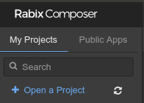
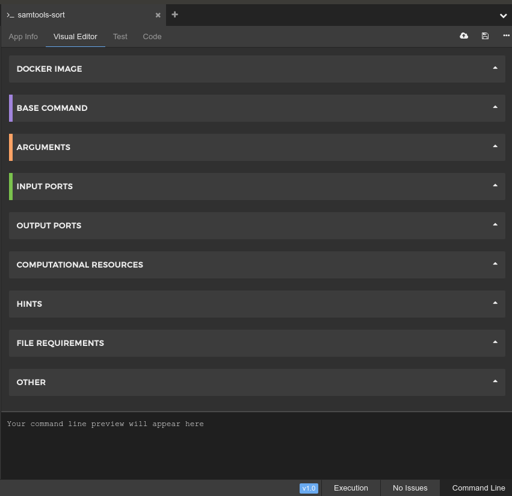
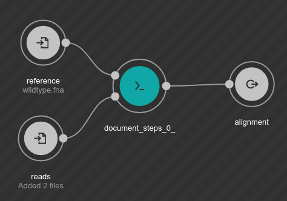

layout: true
class: content
---
# Common Workflow Language for Bioinformatics

.center[

### Michael Milton
]
---

.container[
.row[
.col-10[

]
.col-2[

]
]

.row[
.col-8.offset-2[
Providing bioinformatics support for all researchers and students in Melbourne’s biomedical and biosciences precinct.
]
]

]

---
class: center, middle

.center[
# Part 1: Introduction
.fa-container[
.fas.fa-book.fa-10x[]
]
]
---
## Motivation

* Most bioinformatics involves running many command-line tools; aligners like `bwa` variant callers like `gatk`, and RNA
Seq tools like `cuffdiff`
* However, once this list of tools reaches a certain quantity and complexity, it becomes hard to  reproduce exactly what you ran and with what parameters
* A bash script may help with this, but proper workflows...

    * Run fully parallel to speed up execution
    * Work automatically with batch systems like SLURM
    * Are written declaratively, allowing the system to work out the optimal order of execution for you
    * Save you having to hard-code input parameters and temporary files
    * Are much more readable than bash
---
## Housekeeping
* Slides
    * These slides are hosted at <https://tinyurl.com/ycenoxbf>
    * I recommend you open them in your browser so you can follow along
* Downloads for Part 1:
    * Rabix Composer:
        * A graphical CWL editor
        * Absolutely essential for the first part of this workshop
        * <https://github.com/rabix/composer/releases>
    * Test Data
        * The data we will be using to test our workflows is located [here](https://swift.rc.nectar.org.au:8888/v1/AUTH_7ea859948c3a451c9baced6fee813ed1/CWL%20Workshop%20Assets/cwl.tar.gz).
        * Please download it now so you have a copy for later
    * Docker
        * An engine for running tools inside containers
        * <https://store.docker.com/search?type=edition&offering=community>
---
## CWL Structure
* Tools .fas.fa-wrench[]
    * Are wrappers that describe to the CWL engine how a command-line tool works
    * List its inputs and outputs, and the command to produce one from the other
    * Aren't workflow-specific, so some already exist for commonly used tools
* Workflows .fas.fa-share-alt[]
    * Explain how tools are connected to each other and in what order
    * Are generally project-specific
    * Can be nested inside each other
---

class: center, middle

.center[
# Part 2: Tools
.fa-container[
.fas.fa-wrench.fa-10x[]
]
]

---
## Obtaining Tool Definitions

There are a few useful sources of CWL tool definitions:
* Dockstore
    * <https://dockstore.org>
    * Dockstore - a database of CWL and WDL workflows and tools
    * Once you find a tool definition you like, click:
        * "Files" → "Descriptor Files" → Download
    * Unfortunately many of these definitions are out of date...

.center[

]
---
## Obtaining Tool Definitions

There are a few useful sources of CWL tool definitions:
* Official CWL Workflows Repository
    * <https://github.com/common-workflow-language/workflows>
    * If you clone the entire repo, it will provide a useful library of tool definitions:
    ```bash
    git clone https://github.com/common-workflow-language/workflows
    ```
---
## Obtaining Tool Definitions
.alert.alert-primary[
.alert-heading[
### Exercise
]
.row[
.col-8[
* Clone the CWL Workflows repo
* Open the repo in the Rabix Composer
* Find and open the tool definition for `bwa mem` to ensure it's valid
]
.col-4[

]
]
]
---
## Wrapping Samtools
.alert.alert-primary[
.alert-heading[
### Exercise
]
Follow along with the instructions to make a tool wrapper for `samtools sort`
]
---
## Wrapping Samtools
1\. Start by making a new tool definition in Rabix

.center[

]
---
## Wrapping Samtools
2\. Name it after the tool you're wrapping

.center[

]
---
## Wrapping Samtools
.row[
.col-9[

]
.col-3[
* The main sections we will focus on are:
    * Base Command
    * Input Ports
    * Output Ports
    * Other
* Feel free to collapse the other sections
* Ignore the Arguments section
]
]
---
## Wrapping Samtools
3\. Add the "base command" - the fixed part of the command that will never change

* Make sure that each part of the command is on a new line
.center[

]
---
## Wrapping Samtools

4\. Define the inputs(s)

.row[
.col-8[
Each input has:
* A name (`ID`)
* A type:
    * `boolean`, `int`, `long`, `float`, `double`, `string`, `File`, or `Directory` for single values
    * An array of the above types, e.g. `File[]`
* A way for this input to be used on the command line. Either:
    * With a numerical `Position` for positional arguments like `gzip some_file`. Here the position is 0 (the first positional argument)
    * With a `Prefix` for named arguments, e.g. `java -jar something.jar`. Here the input prefix is `-jar`

]
.col-4[

]
]
---
## Wrapping Samtools

5\. Define the output(s)

.row[
.col-8[
Each output has:
* A name (`ID`)
* A type (same as an input)
* A glob/filepath which indicates how to find this file. In this case, the file is located wherever we piped stdout

]
.col-4[

]
]
---
## Wrapping Samtools

6\. If the command produces output from stdout, you need to pipe it to a file so that it can be picked up by the output
glob

.center[

]
---
## Wrapping Freebayes
.alert.alert-primary[
.alert-heading[
### Exercise
]
* [Freebayes](https://github.com/ekg/freebayes) is a variant caller, which takes a BAM alignment and determines how this alignment differs from the "normal"
reference genome
* Freebayes is called on the command-line as follows:
    ```bash
    freebayes --fasta-reference h.sapiens.fasta NA20504.bam
    ```
* Write a new CWL tool wrapper for Freebayes that supports this command
]

---
## Docker
* We have given CWL instructions on how to *run* these tools, but not how to *get* these tools
* For this we can use Docker
* Docker images are tiny virtual machines that have applications pre-installed inside of them
* You can find docker images of many common bioinformatics tools in [Biocontainers](https://biocontainers.pro/registry/)
* Those that aren't on Biocontainers can probably be found by searching [Docker Store](https://store.docker.com/)
* Once you've found a Docker image, you can plug it into the "Docker Image" section in Rabix:

    

---
## Updating our tool to use Docker
.alert.alert-primary[
.alert-heading[
### Exercise
]
* Find an appropriate Docker image for `bwa`, `samtools sort` and `freebayes`, using Biocontainers
* Once you have found the right images, plug them into the "Docker Image" section
]

Now that we have a way to find the actual tools, we can start actually running CWL...

---
## Running Tools
.alert.alert-primary[
.alert-heading[
### Exercise
]

* Open the Test tab for the BWA tool
* Double click each input bubble and browse for the appropriate file we downloaded at the start of this workshop
* Make sure you add all the fasta indexes as secondary files for the fasta reference

.center[

]

]


---
## Secondary Files
* Some files, like indexes, are never considered a main file, but are instead designed to accompany another file,
for example `.bai` files which accompany `bam` alignments, and `.tbi` indices which accompany `vcf` variant calls.
* These are called secondary files:

.center[

]
* Secondary files can accompany both input and output files
* The simplest way to specify secondary files is as a string that will be appended onto the main file
* For example `.bai` means `main_file.bam.bai` is the secondary file name
---
## Dynamic Expressions
* Sometimes, some of the values in our CWL need to be calculated dynamically
* For example, a command might create an output file whose name is based on the input file
* For example, `gzip file.txt` produces `file.txt.gz`
* In order to do this, we can embed an expression in some CWL fields

---
## Dynamic Expressions
### Parameter References
* The most basic expressions you can use are called [Parameter References](https://www.commonwl.org/v1.0/CommandLineTool.html#Parameter_references)
* These consist of an expression in this form: `$(...)`
* For instance, `$(inputs.extractfile)`
* These use a subset of JavaScript syntax that allows for property access and nothing else
* You can use multiple `$(...)` expressions within the one string
---
## Dynamic Expressions
### Variables
* Within the scope of an expression, the following variables are available:
    * `inputs`: a dictionary of all the inputs provided to this tool. If these inputs have the type
        [`File`](https://www.commonwl.org/v1.0/CommandLineTool.html#File) or
        [`Dictionary`](https://www.commonwl.org/v1.0/CommandLineTool.html#Directory), they have special properties
    * `self`: value depends on the specific context of this expression. e.g. when used in `secondaryFiles`, `self`
        is set to the main input or output, so that the function can calculate the secondary files for this file
    * `runtime`:
        * `runtime.outdir`: an absolute path to the designated output directory
        * `runtime.tmpdir`: an absolute path to the designated temporary directory
        * `runtime.cores`: number of CPU cores reserved for the tool process
        * `runtime.ram`: amount of RAM in mebibytes (2**20) reserved for the tool process
        * `runtime.outdirSize`: reserved storage space available in the designated output directory
        * `runtime.tmpdirSize`: reserved storage space available in the designated temporary directory
---
## Dynamic Expressions
### JavaScript Expressions
* If you enable JavaScript expressions with the following line, you can use JavaScript in your expressions for even more
power:
    ```yaml
    requirements:
      - class: InlineJavascriptRequirement
    ```
* The `$(...)` syntax is upgraded into a JavaScript expression, which has all the same abilities as a parameter reference,
but can now calculate values:
    * e.g.
        ```javascript
        $(1 + 2)
        ```
* `${...}` denotes a scope in which functions, variables, loops etc may be used, and a `return` statement is needed
    to return the final value
    * e.g.
        ```javascript
        ${
            var x = 1;
            var y = 2;
            return x + y;
        }
        ```
* Refer to the [expressions](https://www.commonwl.org/v1.0/CommandLineTool.html#Expressions) section of the CWL spec
---
## Wrapping Samtools Index

.alert.alert-primary[
.alert-heading[
### Exercise
]
* Use what you have learned from wrapping `bwa` to make a wrapper for the `samtools index` subcommand
* You can find the samtools manual, including all command-line flags for `samtools index` here: <http://www.htslib.org/doc/samtools.html#COMMANDS_AND_OPTIONS>
* The output from `samtools index` will be the same BAM file that was input, but with its `.bai` index as a secondary file
    * This means your output file Glob will use an expression to find the input filename
    * Hint: `$(input.INPUTNAME.basename)` will return the full path to the input named `INPUTNAME`
    * In addition, to grant access to this file, you need to add `$(input.INPUTNAME)` as an expression in the File Requirements
    section
]
---
## Tool YAML

* CWL tools are written in a structure called `YAML`
* To view the raw YAML in the Rabix viewer, click the "Code" tab at the top
* In YAML, key-value pairs in a dictionary are indicated by a colon `:` and list elements are indicated by a dash `-`:
* The sections we previously worked on correspond to sections in the yaml file:
    * "Base Command" → `baseCommand`
    * "Output Ports" → `outputs`
    * "Input Ports" → `inputs`
---
## Tool YAML
.row[
.col-sm[
```yaml
class: CommandLineTool
cwlVersion: v1.0
id: bwa
baseCommand:
  - bwa
  - mem
inputs:
  - id: reference
    type: File
    inputBinding:
      position: 0
  - id: reads
    type: 'File[]'
    inputBinding:
      position: 1
  - id: read_group
    type: string?
    inputBinding:
      position: 0
      prefix: '-R'
```
]

.col-sm[
```yaml
outputs:
  - id: alignment
    type: File
    outputBinding:
      glob: alignment.bam
label: bwa
stdout: alignment.bam
```
]
]
---
## Tool YAML

* This is a tool (as opposed to a workflow)
    ```yaml
    class: CommandLineTool
    ```
* This follows version 1.0 of the CWL standard:
    ```yaml
    cwlVersion: v1.0
    ```
* This tool is called `bwa`:
    ```yaml
    id: bwa
    label: bwa
    ```
* The base command is `bwa mem`:
    ```yaml
    baseCommand:
      - bwa
      - mem
      ```
---

## Tool YAML
.row[
.col-sm[
* The inputs:
    ```yaml
    inputs:
      - id: reference
        type: File
        inputBinding:
          position: 0
      - id: reads
        type: 'File[]'
        inputBinding:
          position: 1
      - id: read_group
        type: string?
        inputBinding:
          position: 0
          prefix: '-R'
    ```
]
.col-sm[
* The outputs (including stdout):
    ```yaml
    outputs:
      - id: alignment
        type: File
        outputBinding:
          glob: alignment.bam
    stdout: alignment.bam
```
]
]
---
## Wrapping Somatic Sniper
.alert.alert-primary[
.alert-heading[
### Exercise
]
* Somatic Sniper is a (bad) somatic variant caller
* Its command line usage can be found [here](https://github.com/genome/somatic-sniper/blob/master/gmt/documentation.md#usage)
* Use what you've learned about YAML tool definitions to write a tool definition for `bam-somaticsniper`
* Note that we want VCF output!
]
---
class: center, middle

.center[
# Part 3: Writing Workflows
.fa-container[
.fas.fa-share-alt-square.fa-10x[]
]
]
---
## Workflows in the Rabix Composer

* Refresher: workflows define how your tools connect to each other to form a data flow
* In Rabix, you add tools to your workflow by dragging and dropping from the sidebar
.center[

]
* To connect the tools, you then drag a line between input ports and output ports
.center[
<video controls autoplay loop>
    <source src="images/connect.mp4" type="video/mp4">
</video>
]
---
* To specify an input that the user must provide, drag it onto empty space
.center[
<video controls autoplay loop>
    <source src="images/rabix_workflow_inputs2.mp4" width="518" height="282" type="video/mp4">
</video>
]
* To specify an output that is not used by another tool, drag it onto empty space
.center[
<video controls autoplay loop>
    <source src="images/rabix_workflow_output2.mp4" width="518" height="282" type="video/mp4">
</video>
]
---
## Making a Variant Calling Pipeline in Rabix
.alert.alert-primary[
.alert-heading[
### Exercise
]
* Make a basic workflow that connects:
    * `bwa` → `samtools sort` → `samtools index` → `freebayes`
]
---
## Subworkflows
* Often when making workflows you will want to encapsulate a whole pipeline of tools and re-use that together
as a single unit, for example "alignment"
* To do this, simply make a workflow that encapsulates this functionality, and use as a step in another workflow
* In the Rabix composer, you can drag workflows onto a workflow in the same way you add tools, however they have this
logo:
.fas.fa-share-alt.fa-rotate-180[]
.center[

]

---
# A Tumour-Normal Variant Caller
.alert.alert-primary[
.alert-heading[
### Exercise
]
* First, make an alignment workflow that connects:
    * `bwa` → `samtools sort` → `samtools index`
* Next, make a tumour-normal workflow that uses this workflow to align both the tumour and the normal reads, and then
feeds the alignments into Somatic Sniper
]

---
## Workflows in CWL Files
* Like CWL tools, workflows are represented in a YAML format

.row[
.col-sm[
```yaml
cwlVersion: v1.0
class: Workflow
inputs:
  inp: File
  ex: string

outputs:
  classout:
    type: File
    outputSource: compile/classfile
```
]
.col-sm[
```yaml
steps:
  untar:
    run: tar-param.cwl
    in:
      tarfile: inp
      extractfile: ex
    out: [example_out]

  compile:
    run: arguments.cwl
    in:
      src: untar/example_out
    out: [classfile]
```
]
]
---
* All workflows have the class "Workflow"
    ```yml
    class: Workflow
    ```
* The workflow needs a list of inputs, which will then feed into the tools:
    ```yaml
    inputs:
      inp: File
      ex: string
    ```

* We also pick certain outputs from the tools in this workflow to use as workflow outputs.
    For this, we use the format `outputSource: step_name/output_name`
    ```yaml
    outputs:
      classout:
        type: File
        outputSource: compile/classfile
    ```
---
* The `steps` section is a dictionary of `step_name: step_body` which contains the body of the workflow
* Each step has:
    * A name:
    ```yaml
      compile:
    ```

    * A workflow or tool to run for this stage
    ```yaml
        run: arguments.cwl
    ```

    * A list of inputs with a source for each.
    ```yaml
        in:
          src: untar/example_out
    ```
    In this case, the `src` parameter is provided by the `example_out` parameter of the step named `untar`

    * A list of outputs we intend to use in the wider workflow
    ```yaml
        out: [classfile]
    ```
---
.alert.alert-primary[
.alert-heading[
## Exercise - Manual Workflow
]
* Using YAML, re-implement the basic germline variant calling workflow
* As before, this should connect:
    * `bwa` → `samtools sort` → `samtools index` → `freebayes`
]
---

* Downloads for Part 2:
    * cwltool:
        * A simple CWL executor
        * <https://github.com/common-workflow-language/cwltool#install>
    * Python 3:
        * Language runtime used by many CWL executors
        * <https://www.python.org/downloads/>


